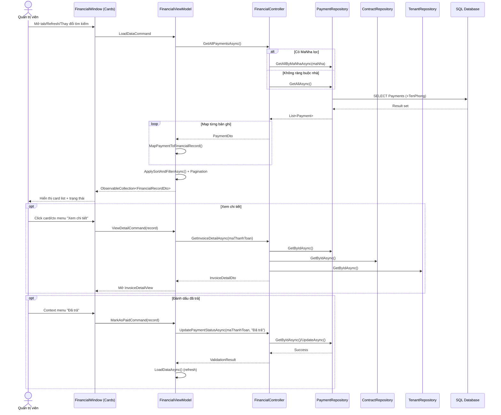
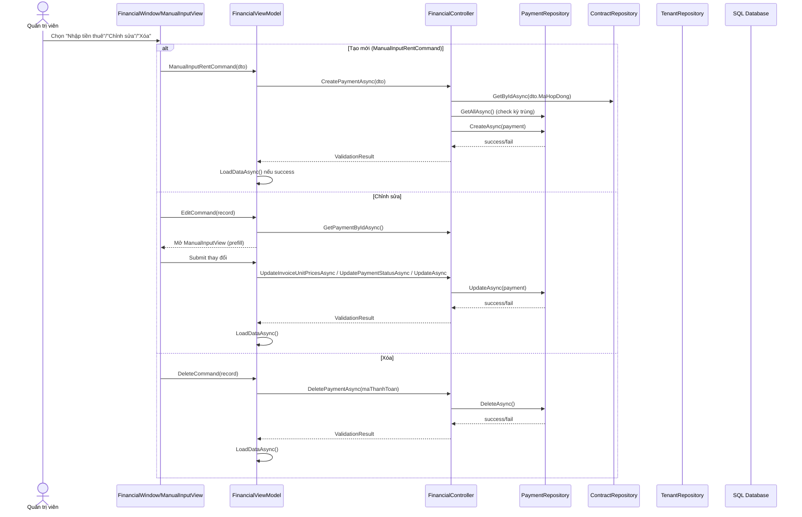
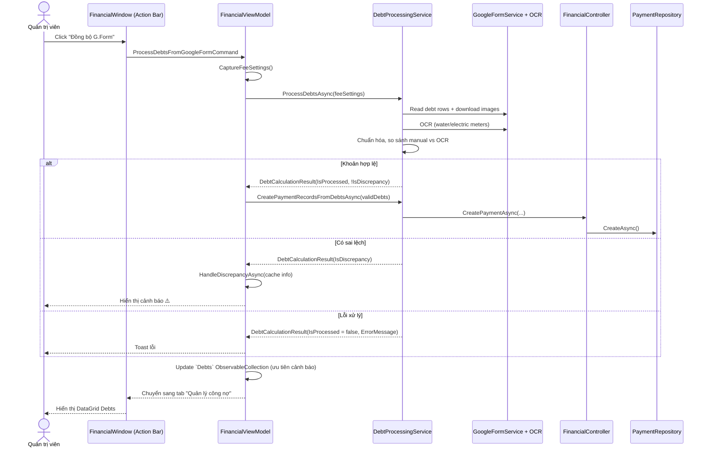
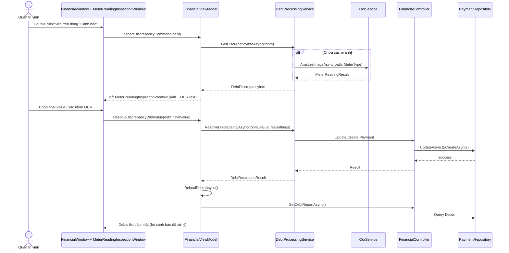

# Sequence cho Quản lý tài chính (2025-11 cập nhật)

Tài liệu này phản ánh **đầy đủ các luồng vẫn còn hoạt động trong `FinancialWindow.xaml`**. Tab Báo cáo (biểu đồ/KPI) đã bị loại bỏ khỏi UI, do đó mọi sequence chỉ xoay quanh hai view còn lại: **“Tất cả bản ghi”** và **“Quản lý công nợ”**.

## 0. Bối cảnh & thành phần chính

| Thành phần | Mô tả |
| --- | --- |
| `FinancialWindow` (WPF) | Chứa 2 tab hiển thị card + DataGrid, action bar với tìm kiếm, sort, nút “Đồng bộ G.Form” và vùng cấu hình phí cố định. |
| `FinancialViewModel` | Quản lý state (`FinancialRecords`, `Debts`, `IsAllRecordsView`, `IsDebtsView`, `IsLoading`, `SearchText`, fee inputs, pagination...) và toàn bộ command. |
| `FinancialController` | Business layer gọi repository/service tương ứng. |
| Repository (`PaymentRepository`, `ContractRepository`, `TenantRepository`, `RentedRoomRepository`) | Đọc/ghi dữ liệu SQL. |
| `DebtProcessingService` + `GoogleFormService` + `OcrService` | Pipeline tự động xử lý Google Form + AI OCR, cache thông tin sai lệch. |
| SQL Database | Lưu Payment, Contract, Tenant, Debt, cấu hình... |

Các sequence phía dưới được cập nhật để phù hợp với giao diện hiện tại, không còn nhắc tới các widget KPI/Chart.

---

## 1. Load & hiển thị thanh toán (All Records view)

Luồng kích hoạt khi:
- Admin mở tab “Tất cả bản ghi” / bấm Refresh.
- Thay đổi `SearchText`, sort hoặc chuyển trang (đều dẫn tới `LoadDataCommand`/`ApplySortAndFilterAsync`).

**Ghi chú chính**

- `FinancialRecords` được binding vào `ItemsControl` card view, context menu chia sẻ chung DataContext.
- Pagination dùng `PageInfo`, `PageNumbers`, `PreviousPageCommand`, `NextPageCommand` và converter `PageNumberEqualsMultiConverter`.
- `SearchText` là two-way binding; mỗi thay đổi sẽ trigger filter cục bộ trước khi gọi API mới (tùy cấu hình).

---

## 2. Tạo/Xóa/Chỉnh sửa thanh toán thủ công

Các thao tác phát sinh từ context menu trên card hoặc màn `ManualInputView`.

**Ghi chú**

- `CreatePaymentAsync` tự tính điện/nước dựa trên fee inputs hiện hành, số người, chỉ số tháng trước.
- `ManualInputView` dùng chung cho create/edit, binding vào ViewModel để tái sử dụng logic validation.
- Sau mọi thao tác, danh sách card/pagination được refresh để giữ UI đồng bộ.

---

## 3. Xử lý công nợ từ Google Form (ProcessDebtsFromGoogleFormCommand)

Kích hoạt bằng nút **“Đồng bộ G.Form”**. Trước khi đi vào pipeline, ViewModel snapshot các fee inputs (`WaterFeeInput`, `InternetFeeInput`, `SanitationFeeInput`, …).

**Ghi chú**

- `DebtProcessingService` cache `DebtDiscrepancyInfo` cho từng phòng (ảnh, text OCR, `Confidence`, `WarningNote`).
- Payment hợp lệ được ghi xuống DB thông qua controller để đảm bảo reuse validation.
- Các khoản cảnh báo sẽ mang trạng thái “Cảnh báo” trong DataGrid cho tới khi được Admin giải quyết.

---

## 4. Kiểm tra & giải quyết sai lệch (Debts view)

Luồng xử lý thủ công các dòng cảnh báo từ DataGrid `Debts`.

**Ghi chú**

- `InspectDiscrepancyCommand` cũng có thể được trigger từ panel phụ (nếu UI bổ sung).
- `ResolveDiscrepancyAsync` tái sử dụng fee settings hiện hành để tính lại tiền nước/internet khi tạo Payment mới.
- Sau khi xử lý, `SelectedDebtDiscrepancy` được reset để panel không hiển thị thông tin cũ.

---

## 5. Tổng hợp chức năng, automation & AI đang áp dụng

| Nhóm chức năng | Thành phần liên quan | Mô tả |
| --- | --- | --- |
| Load danh sách thanh toán | `LoadDataAsync`, `GetAllPaymentsAsync`, `PaymentRepository` | Lấy dữ liệu Payment, map sang `FinancialRecordDto`, áp dụng filter/sort/pagination. |
| Tìm kiếm & phân trang | `SearchText`, `ApplySortAndFilterAsync`, `PageNumbers`, `Previous/NextPageCommand` | Lọc realtime, điều hướng trang trong card view. |
| Xem/đánh dấu chi tiết | `ViewDetailCommand`, `MarkAsPaidCommand`, `InvoiceDetailView` | Hiển thị hóa đơn đầy đủ và cập nhật trạng thái thanh toán. |
| Tạo/Chỉnh sửa/Xóa Payment | `CreatePaymentAsync`, `UpdatePaymentStatusAsync`, `DeletePaymentAsync`, `ManualInputView` | Quản lý thanh toán thủ công, đọc fee inputs và số liệu tháng trước. |
| Thêm chi phí phát sinh | `CreateExpenseAsync`, `ExpenseDto` | Cộng thêm điện/nước/internet/vệ sinh/giữ xe/khác cho từng Payment. |
| Auto tạo công nợ hàng tháng | `AutoGenerateDebtsAsync`, `ContractRepository`, `RentedRoomRepository` | Sinh Payment “Chưa trả” cho hợp đồng đang hiệu lực. |
| Đồng bộ Google Form | `ProcessDebtsFromGoogleFormCommand`, `DebtProcessingService`, `GoogleFormService` | Đọc dữ liệu sheet, chuẩn hóa thông tin nhập tay. |
| AI OCR & phát hiện sai lệch | `OcrService.AnalyzeImageAsync`, `DebtDiscrepancyInfo`, `MeterReadingResult` | Dùng AI đọc ảnh công tơ, so sánh manual vs OCR, tính `Confidence`. |
| Kiểm tra & giải quyết sai lệch | `InspectDiscrepancyCommand`, `ResolveDiscrepancyCommand`, `ResolveDiscrepancyAsync` | Cho phép Admin xem ảnh, chọn giá trị cuối và tạo/cập nhật Payment tương ứng. |
| Đồng bộ danh sách cảnh báo | `ReloadDebtsAsync`, `DebtProcessingService.GetRoomsWithDiscrepancies`, `GetDebtReportAsync` | Gộp dữ liệu cache + DB để cập nhật DataGrid `Debts`. |
| Lịch sử giao dịch | `GetTransactionHistoryAsync`, `PaymentRepository.GetTransactionHistory*` | Phục vụ màn lịch sử dòng tiền (nếu tính năng được bật). |
| Đồng bộ đơn giá dịch vụ | `UpdateUnitPricesForCurrentAndUnpaidPaymentsAsync` | Áp dụng đơn giá mới cho Payment “Chưa trả”. |

### Ghi chú về AI/OCR

- `OcrService` có thể tích hợp Google Vision, Azure Cognitive Services hoặc dịch vụ OCR khác để đọc chỉ số điện/nước từ ảnh của Google Form.
- `DebtProcessingService` lưu thêm `Confidence`, `WarningNote`, đường dẫn ảnh; UI dùng màu sắc (DataGrid triggers) để nhấn mạnh các khoản nguy cơ cao.
- Các khoản cảnh báo **không** tạo Payment ngay; chỉ sau khi Admin xác nhận ở `MeterReadingInspectionWindow` thì payment mới được ghi xuống DB.

---

> Khi bổ sung use case mới (ví dụ đồng bộ ví điện tử, bật lại tab Báo cáo), hãy thêm section Mermaid tương ứng để mọi sequence luôn bám sát `FinancialWindow`.

